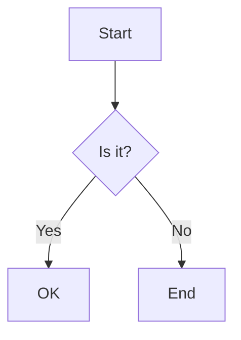

# markdown-server

A CLI tool to serve and preview markdown files with directory navigation, code highlighting, and mermaid diagram support.

## Features

- 📁 Directory tree navigation
- 📝 Markdown preview with syntax highlighting
- 📊 Mermaid diagram rendering
- 🔄 Toggle between rendered preview and source view
- 🚀 Easy to use CLI interface

## Installation

You can use `markdown-server` without installing it by using `npx`:

```bash
npx markdown-server
```

Or you can install it globally:

```bash
npm install -g markdown-server
```

## Usage

### Basic Usage

Navigate to any directory containing markdown files and run:

```bash
npx markdown-server
```

This will start a server on port 3000 and open your browser automatically.

### Command Line Options

```
Usage: markdown-server [options]

A CLI tool to serve and preview markdown files with directory navigation

Options:
  -V, --version                output the version number
  -p, --port <port>            Port to use (default: "3000")
  -o, --open                   Open browser automatically (default: true)
  -d, --directory <directory>  Directory to serve (default: current directory)
  -h, --help                   display help for command
```

### Examples

Serve files from a specific directory:

```bash
npx markdown-server --directory ./docs
```

Use a different port:

```bash
npx markdown-server --port 8080
```

Start server without opening browser:

```bash
npx markdown-server --no-open
```

## Features in Detail

### Directory Navigation

The left sidebar displays a tree view of all directories and markdown files. Click on folders to expand/collapse them and click on files to preview them.

### Markdown Preview

When you select a markdown file, it will be rendered in the preview pane with:

- Syntax highlighting for code blocks
- Mermaid diagram rendering
- GitHub-style markdown formatting

### Source View

You can toggle between the rendered preview and the source markdown by clicking the "Toggle View" button.

## Mermaid Diagram Support

To include a mermaid diagram in your markdown, use the following syntax:

````markdown

````

## License

MIT
