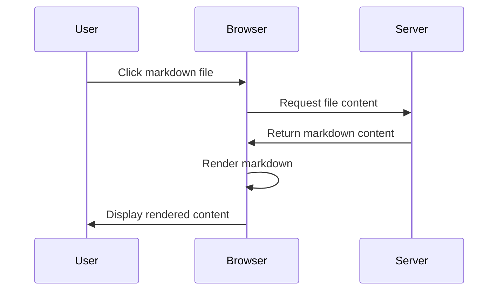

# Nested Markdown Example

This is a markdown file in a subdirectory to test directory navigation.

## Complex Mermaid Diagram



## Code Example with Syntax Highlighting

```python
def fibonacci(n):
    if n <= 1:
        return n
    else:
        return fibonacci(n-1) + fibonacci(n-2)

# Print the first 10 Fibonacci numbers
for i in range(10):
    print(fibonacci(i))
```

## Math Formulas

When using a math extension:

$$
f(x) = \int_{-\infty}^{\infty} \hat{f}(\xi) e^{2 \pi i \xi x} d\xi
$$

## Nested Lists

1. First level
   - Nested item
     - Deeper nested item
       - Even deeper
   - Back to second level
2. Another first level
   1. Ordered nested
   2. Another ordered nested
